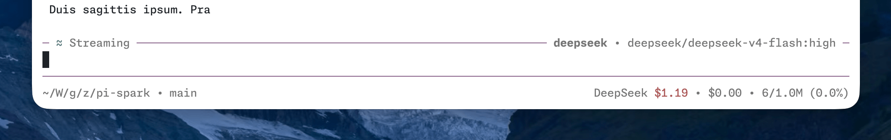
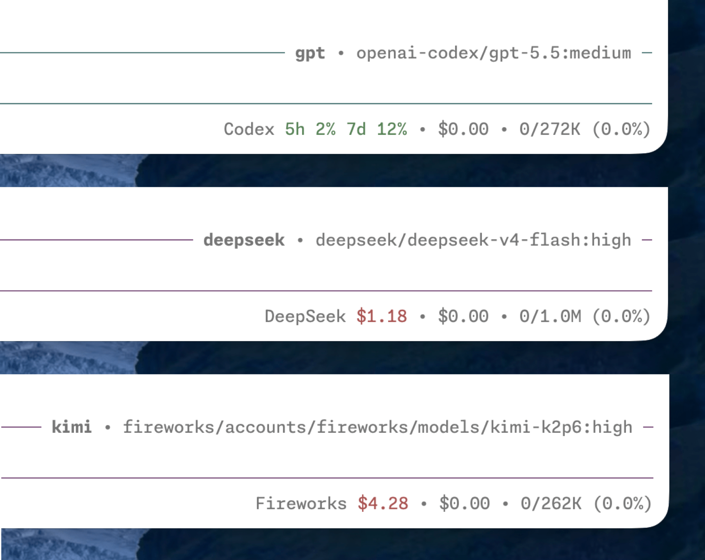
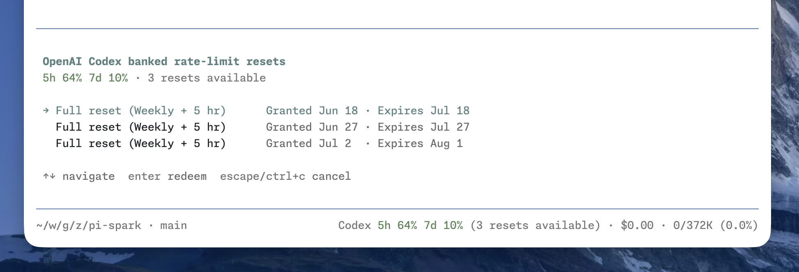
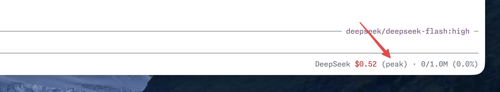
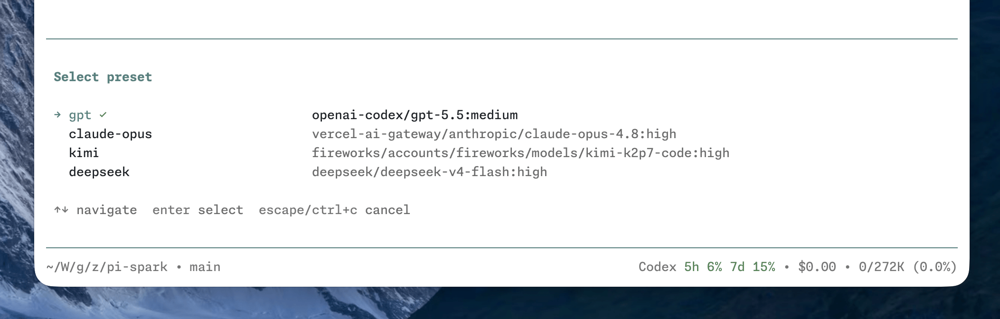
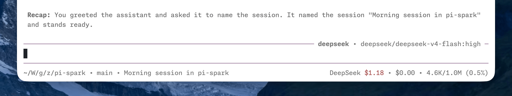
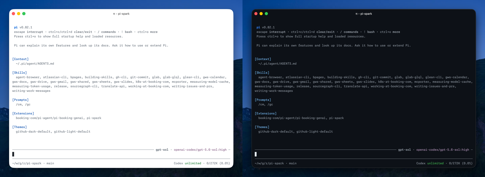

# pi-spark

[Pi](https://pi.dev/) package that polishes your daily experience.


## Install
```bash
# Install this package from npm (recommended)
pi install npm:pi-spark
# Or install all extensions from this monorepo
pi install git:github.com/maplezzk/pi-extensions
```

Reload or restart Pi after installation.

## Features

### Compact TUI: editor and footer

pi-spark ships with a custom editor and footer, replacing the default ones. The compact TUI gives you a calm experience without distraction.

- The editor shows a working indicator inspired by [Amp](https://ampcode.com/), the elapsed time since you sent the message, and the current model on the top border. If you use [presets](#presets), the active preset appears there too.
- The footer shows session information, extension statuses, cost, and context usage on one line. Set `style` to `p10k` for a lean powerlevel10k left prompt (OS icon, fish-shortened path, `on`, and branch). That style needs a Nerd Font.



> Earlier pi-spark releases included a custom fullscreen renderer. Pi [0.84.0](https://github.com/earendil-works/pi/releases/tag/v0.84.0) now provides fullscreen mode natively, with a sticky editor and footer and an independently scrollable transcript, so pi-spark has retired its workaround. Enable Pi's fullscreen mode in `/settings`, with `pi --tui-mode fullscreen`, or in Pi's `settings.json`:
>
> ```json
> {
>   "tuiMode": "fullscreen"
> }
> ```
>
> When upgrading, remove the retired `fullscreen` field from `spark.json`.

### Credits

pi-spark shows the active provider's credit balance or rate-limit usage in the status line, so you can keep an eye on what's left without leaving the terminal.

- Supported providers: DeepSeek, Fireworks, Kimi Code, Moonshot, OpenAI Codex, OpenRouter, and Vercel AI Gateway.
- Most provider fetching follows [CodexBar](https://github.com/steipete/codexbar). Fireworks is the exception: its balance sits behind an internal gRPC API, reverse-engineered from the `firectl` binary (see [Reverse-Engineering Fireworks Credits](./docs/reverse-engineering-fireworks-credits.md)).



#### OpenAI Codex banked resets

Banked rate-limit resets are saved benefits that can reset eligible Codex usage windows when redeemed. When available, their count appears after the usage windows. Run `/codex-resets` to inspect each reset and its expiration date, then select one to redeem. See [OpenAI Codex Banked Rate-Limit Resets](./docs/openai-codex-banked-rate-limit-resets.md) for the underlying behavior and internal APIs.



#### Peak/off-peak pricing

Pi does not currently support time-based pricing, so its cost estimates can be inaccurate for providers with peak/off-peak rates, such as [DeepSeek](https://api-docs.deepseek.com/quick_start/pricing). pi-spark updates model cost metadata so subsequent usage calculations reflect the current rate.



### Presets

pi-spark lets you define named model presets in `spark.json` (see [Configuration](#configuration)), so you can switch between models and thinking levels without retyping provider details. The active preset is shown on the editor's top border.

- Switch interactively with `/preset`, or jump straight to one with `/preset <name>`.
- Start pi on a given preset with `pi --preset <name>`.
- Cycle presets with `ctrl+super+p` (forward) and `ctrl+shift+super+p` (backward); `super` is `command` on macOS and needs a terminal that forwards it.



### Clean mode

Clean mode collapses an entire agent run into one duration header, leaving the final answer visible. Press `F2` or run `/clean` to expand the hidden narration, tool calls, and extension work entries. `Shift+F2` expands or collapses all action groups.

- The run stays expanded while the agent is working and collapses after `agent_settled`, unless you manually changed it during that run.
- Fullscreen TUI supports clicking the run header, action groups, and individual tool summaries.
- `/clean config` and `/config:clean-mode` open the interactive settings panel. `/config:clean-mode key=on|off` changes a boolean directly.
- Set `cleanMode` to `false` to disable all folding. An existing `extensions/pi-clean-mode/config.json` is read only when `spark.json` does not set `cleanMode`.
- Remove `npm:pi-clean-mode` if it is still installed, or its commands and shortcuts will conflict.

### Metrics

pi-spark records session elapsed time and token-generation telemetry. The editor border shows the total wait, for example `⏱ 47s`, and it keeps counting across turns.

- `on-stop` (default): the transcript stays quiet during the run. When the agent settles, one summary line reports elapsed time, blended TPS, TTFT, tokens, stalls, and cost.
- `live`: one line is emitted at the end of every turn. A multi-turn run also gets a final `⏱ <duration>` line.
- Every turn is still stored as a `tps` session entry. Remove `npm:@monotykamary/pi-tps` if it is installed, or both extensions will write duplicate entries.
- Run `/config:metrics`, or `/config:metrics enable|disable|live|on-stop|reset`. An existing `extensions/pi-metrics/config.json` is used only when `spark.json` does not set `metrics`.

### Session resources

Typing `#` at a token boundary opens a tabbed picker above the spark editor. It lists files, web URLs, and PR/MR links collected from successful tool results in the current session. Enter inserts a normal reference such as `#src/index.ts`; it does not read the file again or add hidden context.

- The picker stays outside the spark editor, so the two no longer replace each other.
- Run `/config:session-resources`, or `/config:session-resources enable|disable`. `show`/`hide` and `/session-resources` remain aliases.
- Set `resources` to `false` to disable it. An old `extensions/pi-session-resources/config.json` with `"enabled": false` is used only when `spark.json` does not set `resources`.
- Remove `npm:pi-session-resources` if it is still installed, or the command names conflict.

### Session and terminal naming

Naming is now a Spark feature, migrated from `pi-naming`.

- The first real user input in a new, unnamed session generates a title in the background. Automatic naming attempts once, never overwrites an existing title, and ignores extension-injected input.
- `/rename [name]` applies an explicit name or generates one from **all user messages on the current branch**. Later corrections take precedence; procedural follow-ups such as “continue” do not replace the main topic.
- `/config:naming` opens the settings menu; `/config:naming reset` restores defaults. `/naming-config` and `/pi-naming-config` remain aliases.
- `naming.targets` independently controls the Pi session, workspace and tab. Set both terminal targets to `false` for session-only naming without loading the terminal adapter. Set `naming: false` to disable automatic and manual naming.
- Naming uses the current Pi model/authentication and makes a separate background request. OpenAI Codex requests use isolated UUIDv7 sessions and clean them up afterwards. Generated names obey the length limit; explicit names are not truncated.
- Manual requests supersede pending automatic requests. Session changes invalidate pending results and errors. Failed or unsupported terminal targets do not prevent the other targets from being named.

`pi-terminal-mux` stays an independent, automatically installed library. It executes terminal operations; Spark owns title generation and naming policy. Child terminal ownership comes from `PI_TERMINAL_RENAME_CONTEXT`: shared or unidentified targets are skipped, never replaced with the current focus. Restricted children cannot rename a shared workspace. Spark requires a mux version exporting `resolveTerminalRenameTargets` and `renameTerminalTarget`; release CI publishes terminal-mux before Spark and verifies the dependency range is available on npm.

#### Migrating from pi-naming

Remove the old extension to avoid duplicate commands and automatic requests:

```bash
pi remove npm:pi-naming
```

Also remove any explicit old entrypoint from extension lists, then `/reload`. If installed in project scope, remove the corresponding local package declaration too. This repository no longer loads or publishes the standalone package; previously published npm versions are not changed.

When **neither** global nor project `spark.json` defines `naming`, Spark reads `<agent-dir>/extensions/pi-naming/config.json` as a read-only fallback. Any canonical section, including `{}` or `false`, takes precedence over the entire legacy config. The config menu writes only `spark.json`, preserves other features, and writes the project file when that file explicitly owns `naming`; otherwise it writes the global file. Invalid naming settings or unreadable configuration disable naming rather than unexpectedly starting model requests.

To enable naming in isolated Pi subagents, explicitly load the installed Spark entrypoint in their extension allowlist. This also loads Spark's other features: disable unwanted features in the applicable `spark.json`. Installing Spark only in the parent does not bypass child isolation.

### Recap

pi-spark generates a short recap of the current session after it goes idle, or on demand, inspired by [Claude Code's session recap](https://code.claude.com/docs/en/interactive-mode#session-recap).

- A recap is generated automatically once the session stays idle past `recap.idle` in `spark.json`.
- Run `/recap` to generate one manually at any time.
- The recap generation can use its own model, configured separately from your working model.



## Configuration

pi-spark reads config from `~/.pi/agent/spark.json` and from the current project's `.pi/spark.json`. Project config overrides matching global fields. The agent directory respects `PI_CODING_AGENT_DIR`. See [config.example.json](./config.example.json) for naming defaults.

For example:

```json
{
  "editor": {
    "spinner": "dots"
  },
  "footer": false,
  "presets": {
    "claude-opus": {
      "provider": "anthropic",
      "model": "claude-opus-4-8",
      "thinkingLevel": "high"
    },
    "gpt": {
      "provider": "openai-codex",
      "model": "gpt-5.5",
      "thinkingLevel": "medium"
    }
  },
  "recap": {
    "idle": "5m",
    "provider": "openai-codex",
    "model": "gpt-5.4-mini",
    "thinkingLevel": "off"
  }
}
```

### References

All fields are optional. Each top-level feature runs with the defaults below unless you [turn it off](#turn-off-the-features-you-dont-like).

| Field | Value (or `false`) | Description |
| --- | --- | --- |
| `cleanMode` | `CleanModeConfig` | Collapses one agent run into a duration header and action groups. |
| `credits` | `CreditsConfig` | Shows the active provider's credit balance or rate-limit usage in the status line. |
| `editor` | `EditorConfig` | Shows a working indicator and the current model on the editor's top border. |
| `footer` | `FooterConfig` | Shows session info, extension statuses, cost, and context usage. |
| `metrics` | `MetricsConfig` | Shows elapsed time and records TPS, TTFT, token, and cost telemetry. |
| `naming` | `NamingConfig` | Automatic titles and `/rename` for sessions and owned terminal targets. |
| `resources` | `{}` | Enables the `#` session resource picker. Set it to `false` to disable the picker. |
| `presets` | `{ [name]: Preset }` | Defines named model presets, keyed by name. |
| `recap` | `RecapConfig` | Generates a session recap when idle or on demand. |

#### `CleanModeConfig`

| Field | Default | Description |
| --- | --- | --- |
| `enabled` | `true` | Master switch. `cleanMode: false` also disables the feature. |
| `autoExpandWhileRunning` | `true` | Expands work while the agent is running and collapses it after settlement. |
| `showRunHeader` | `true` | Shows the duration header above the final answer. |
| `enableActionGroups` | `true` | Groups tool calls into collapsible action summaries. |
| `showActivityArea` | `true` | Shows current activity above the editor. |
| `activityRows` | `4` | Maximum activity rows, from 1 to 20. |
| `animateActivity` | `true` | Animates the activity marker. |
| `hideThinking` | `true` | Hides thinking blocks in clean mode. |
| `hideExtensionEntries` | `true` | Collapses informational extension work entries with the run. |

#### `CreditsConfig`

All supported providers are enabled by default. Set a provider to `false` to disable its credits status and pricing updates, or to `true` to override a global `false` in project config.

```json
{
  "credits": {
    "providers": {
      "fireworks": false,
      "openai-codex": true
    }
  }
}
```

| Field | Value | Description |
| --- | --- | --- |
| `providers` | partial map of provider IDs to booleans | Enables or disables credits for individual providers. Valid IDs: `deepseek`, `fireworks`, `kimi-coding`, `moonshotai`, `moonshotai-cn`, `openai-codex`, `openrouter`, and `vercel-ai-gateway`. |

#### `EditorConfig`

The `spinner` field is optional and defaults to `tildes`. `thinkingLevelIndicator` is also optional and defaults to `border`.

| Field | Value | Description |
| --- | --- | --- |
| `spinner` | `dots` | `⠋, ⠙, ⠹, ⠸, ⠼, ⠴, ⠦, ⠧, ⠇, ⠏` |
|  | `lights` | `○, ●` |
|  | `tildes` (default) | `∼, ≈, ≋, ≈, ∼` |
|  | `pulse` | `·, •, ●, •, ·` |
| `thinkingLevelIndicator` | `border` (default) | Uses the thinking-level color for the editor border. |
|  | `model` | Uses the thinking-level color for the model name and the dim color for the editor border. |

#### `FooterConfig`

The `statusPosition` field is optional and defaults to `inline`.

| Field | Value | Description |
| --- | --- | --- |
| `statusPosition` | `inline` (default) | Shows extension statuses on the same line as session info, cost, and context usage. |
|  | `below` | Moves extension statuses to a new line below. |
| `style` | `default` (default) | Shortened path, branch, and session name, separated by ` · `. |
|  | `p10k` | Lean powerlevel10k left prompt. The path stays fish-shortened. Requires a Nerd Font. Omits the session name. |

#### `MetricsConfig`

| Field | Value | Description |
| --- | --- | --- |
| `display` | `on-stop` (default) | Emits one summary line after the agent settles. |
|  | `live` | Emits one line at the end of each turn. |

Set `metrics` to `false` to disable both the elapsed label and telemetry.

#### `NamingConfig`

All fields are optional. `automaticNaming` and `manualNaming` default to `true`; `targets.session`, `targets.workspace` and `targets.tab` also default to `true`.

| `title` field | Default | Meaning |
| --- | --- | --- |
| `maxLength` | `15` | Maximum generated Unicode code points. |
| `preferredLength` | `10` | Requested preferred length; must not exceed `maxLength`. |
| `language` | `"auto"` | Dominant message language, or a language such as `"English"`. Independent of UI locale. |
| `instructions` | `""` | Additional naming style instructions, not a template or executable code. |
| `timeoutMs` | `10000` | Request timeout; positive safe integer no greater than `2147483647`. |
| `maxTokens` | `2048` | Output budget, capped by the model limit; reasoning and title share it. |
| `effort` | `"low"` | `minimal`, `low`, `medium`, `high`, `xhigh` or `max`. |

Length and token limits are independent positive safe integers. For longer English titles, use `maxLength: 60`, `preferredLength: 40`, `language: "English"`. Unknown naming fields and invalid values are rejected. Run `/reload` after configuration changes.

#### `Preset`

Each preset must set all three fields.

| Field | Value | Description |
| --- | --- | --- |
| `provider` | string | Provider ID, e.g., `anthropic`. |
| `model` | string | Model ID, e.g., `claude-opus-4-8`. |
| `thinkingLevel` | `ModelThinkingLevel` | Thinking level for the preset. |

#### `RecapConfig`

All fields are optional. If the recap model configuration is incomplete, pi-spark falls back to the session's main model. `thinkingLevel` defaults to `off` (clamped to the model), so recap stays cheap regardless of your working thinking level.

| Field | Value | Description |
| --- | --- | --- |
| `idle` | number (ms) or duration string | How long the session must stay idle before a recap is generated. Accepts a millisecond number or a [parse-duration](https://github.com/jkroso/parse-duration) string (e.g., `"5m"`); minimum 5000 ms, defaults to 5 minutes. |
| `provider` | string | Provider ID for the recap model. |
| `model` | string | Model ID for the recap model. |
| `thinkingLevel` | `ModelThinkingLevel` | Thinking level for the recap model. Defaults to `off`. |

#### `ModelThinkingLevel`

Valid values: `off`, `minimal`, `low`, `medium`, `high`, `xhigh`, `max`.

### Turn off the features you don't like

All features are enabled by default. Set a specific feature to `false` in `spark.json` to disable it.

For example, to disable the customized footer:

```json
{
  "footer": false
}
```

## Themes

pi-spark ships with two custom themes inspired by [GitHub's VS Code themes](https://github.com/primer/github-vscode-theme):

- [`github-light-default`](themes/github-light-default.json)
- [`github-dark-default`](themes/github-dark-default.json)



Select either theme in `/settings`, or configure automatic switching between them:

```json
{
  "theme": "github-light-default/github-dark-default"
}
```

## Development

Run the package checks from the monorepo root:

```bash
npm install
npm run typecheck --workspace pi-spark
npm run check --workspace pi-spark
```

`pi-spark` is based on [zlliang/pi-spark](https://github.com/zlliang/pi-spark) and is maintained and released from this monorepo.

## License

[MIT](./LICENSE.md)
