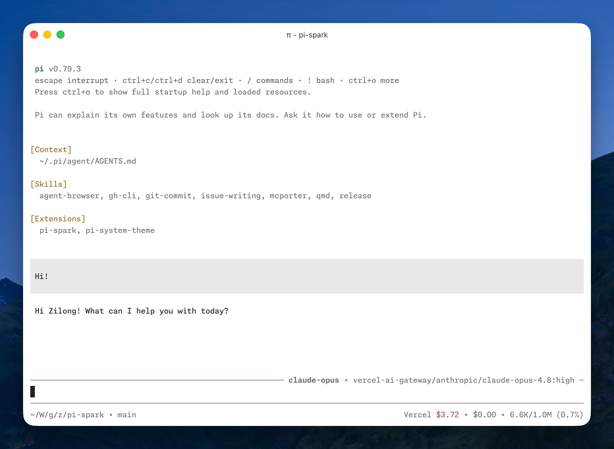

# pi-spark

用于 [Pi](https://pi.dev/) 的日常体验增强扩展。



## 安装

```bash
# 从 npm 安装本包
pi install npm:pi-spark

# 或安装整个扩展仓库
pi install git:github.com/maplezzk/pi-extensions
```

安装后执行 `/reload` 或重启 Pi。

## 功能

### 紧凑 TUI：editor 与 footer

`pi-spark` 提供自定义 editor 和 footer，替换 Pi 的默认组件。

- editor 在顶部边框显示 working 指示和当前模型；使用 presets 时同时显示激活的预设。
- footer 在一行内显示会话信息、扩展状态、花费和上下文用量。
- Pi 0.84.0 起原生支持全屏模式，因此 `pi-spark` 已移除自带的替代实现。用 `/settings`、`pi --tui-mode fullscreen` 或 `settings.json` 中的 `"tuiMode": "fullscreen"` 开启。升级时请从 `spark.json` 删除已废弃的 `fullscreen` 字段。

### Credits

在状态栏显示当前 provider 的余额或速率限制用量。

- 支持 DeepSeek、Fireworks、Kimi Code、Moonshot、OpenAI Codex、OpenRouter 和 Vercel AI Gateway。
- 多数 provider 的取数方式参考 [CodexBar](https://github.com/steipete/codexbar)。Fireworks 例外：它的余额位于内部 gRPC 接口之后，实现来自对 `firectl` 二进制的逆向分析，见 [`docs/reverse-engineering-fireworks-credits.md`](./docs/reverse-engineering-fireworks-credits.md)。
- OpenAI Codex 的 banked rate-limit resets 可以通过 `/codex-resets` 查看并兑换，见 [`docs/openai-codex-banked-rate-limit-resets.md`](./docs/openai-codex-banked-rate-limit-resets.md)。
- Pi 目前不支持按时段计价，`pi-spark` 会更新模型成本元数据，让 DeepSeek 等峰谷定价 provider 的后续用量计算反映当前费率。

### Presets

在 `spark.json` 中定义具名模型预设，避免重复输入 provider 与模型信息。

- `/preset` 交互切换，`/preset <name>` 直接切换。
- `pi --preset <name>` 以指定预设启动。
- `ctrl+super+p` 向前、`ctrl+shift+super+p` 向后循环。`super` 在 macOS 上是 `command`，需要终端转发该修饰键。

### Recap

会话空闲后自动生成简短回顾，灵感来自 Claude Code 的 session recap。

- 空闲时间超过 `recap.idle` 后自动生成。
- `/recap` 可随时手动生成。
- 回顾可以使用独立配置的模型，不必使用当前工作模型。

### Title

首个回合完成后自动为会话命名，便于在会话选择器中查找。

- 只在会话尚无名称时生成。
- 生成过程静默进行，用量记录在会话条目中，与 recap 相同。
- 标题生成可以使用独立配置的模型。

### 流式 write 预览

长时间流式输出的 `write` 工具调用会保持最新几行可见，而不是固定在开头。被省略的行数显示在预览上方；`ctrl+o` 仍可展开完整内容。

## 配置

配置读取顺序：`~/.pi/agent/spark.json`（全局）与当前项目的 `.pi/spark.json`（项目覆盖同名字段）。

```json
{
  "editor": { "spinner": "dots" },
  "footer": false,
  "presets": {
    "claude-opus": { "provider": "anthropic", "model": "claude-opus-4-8", "thinkingLevel": "high" }
  },
  "recap": { "idle": "5m", "provider": "openai-codex", "model": "gpt-5.4-mini", "thinkingLevel": "off" },
  "title": { "provider": "openai-codex", "model": "gpt-5.4-mini", "thinkingLevel": "off" }
}
```

顶层字段全部可选，把功能设为 `false` 即可关闭：

| 字段 | 取值 | 说明 |
| --- | --- | --- |
| `credits` | `CreditsConfig` | 状态栏的余额或速率限制用量。`providers` 可逐个 provider 开关。 |
| `editor` | `EditorConfig` | 顶部边框的 working 指示与模型名。`spinner` 可选 `dots`、`lights`、`tildes`（默认）、`pulse`。 |
| `footer` | `FooterConfig` | 会话信息、扩展状态、花费与上下文用量。`statusPosition` 可选 `inline`（默认）或 `below`。 |
| `presets` | `{ [name]: Preset }` | 具名预设，每个预设必须给出 `provider`、`model`、`thinkingLevel`。 |
| `recap` | `RecapConfig` | 空闲回顾。`idle` 接受毫秒数或 `parse-duration` 字符串，最小 5000 ms，默认 5 分钟。 |
| `title` | `TitleConfig` | 首轮结束后的自动命名。 |
| `write` | `{}` | 流式 `write` 预览。 |

`thinkingLevel` 的合法值：`off`、`minimal`、`low`、`medium`、`high`、`xhigh`、`max`。recap 与 title 的 `thinkingLevel` 默认 `off`，并会被模型的可用等级收敛。

## 主题

随包提供两个受 GitHub VS Code 主题启发的主题：

- [`github-light-default`](./themes/github-light-default.json)
- [`github-dark-default`](./themes/github-dark-default.json)

在 `/settings` 中选择，或配置自动切换：

```json
{
  "theme": "github-light-default/github-dark-default"
}
```

## 开发

从仓库根目录运行：

```bash
npm install
npm run typecheck --workspace pi-spark
npm run check --workspace pi-spark
```

本包目前没有自动化测试，`check` 执行类型检查和打包预检。

## 来源

本包基于 zlliang 的 [`pi-spark`](https://github.com/zlliang/pi-spark)，现由本仓库统一维护和发布。

## 许可证

MIT
